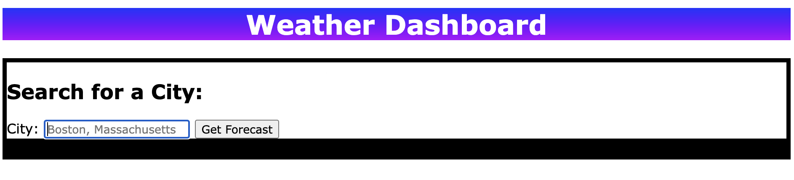
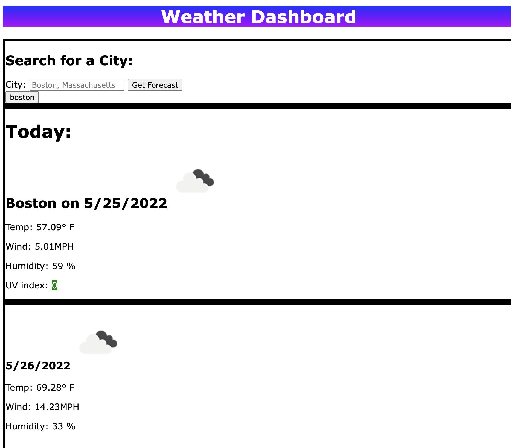
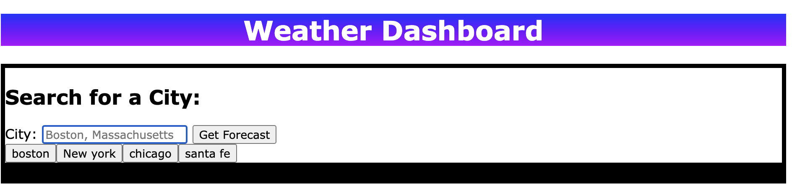

# week-6-weather-app

* [Overview] (#Overview)
* [Installation] (#Installation)
* [Features] (#Features)
* [License] (#License)

## Overview
This is the complete package for a city weather forecast website. After entering a city name (and state for further specificity), the user will be presented with the current forecast, as well as the forecast for the following 5 days.

## Installation
This HTML file requires a .CSS style sheet and .js file for javascript functionality. By placing the entire website folder on a server together, it can be uploaded to a server, and the files can be found. Additionally, several stylesheets and scripts are, respectively, at the top and bottom of the index.html document to link to cdn and .min.js files elsewhere on the internet.

## Features
 
When a user loads the page, they will see a search bar. They'll enter a city or city and state into the search bar and hit submit, upon which several things will happen:

- If a city is found, the current forcast will be displayed, as well as the city name, date, an icon of the current weather, the temperature (in fahrenheit), wind speed, humidity, and UV Index.
- If a city is not found, an alert will display, and the city will be removed from the saved array.
- The color surrounding the UV index will change based on whether the UV index is favorable, moderate, or severe.
- Below the current forcast, the forecast for the next five days will be displayed - the date, an icon displaying the weather, the temperature (in fahrenheit), wind speed, and humidity.
 

- Finally, a button will be added below the search bar to save the city that was entered. Even when the page is refreshed or reloaded, the past cities will stay saved.


 

## License 
Source: choosealicense.com
```
This is free and unencumbered software released into the public domain.

Anyone is free to copy, modify, publish, use, compile, sell, or
distribute this software, either in source code form or as a compiled
binary, for any purpose, commercial or non-commercial, and by any
means.

In jurisdictions that recognize copyright laws, the author or authors
of this software dedicate any and all copyright interest in the
software to the public domain. We make this dedication for the benefit
of the public at large and to the detriment of our heirs and
successors. We intend this dedication to be an overt act of
relinquishment in perpetuity of all present and future rights to this
software under copyright law.

THE SOFTWARE IS PROVIDED "AS IS", WITHOUT WARRANTY OF ANY KIND,
EXPRESS OR IMPLIED, INCLUDING BUT NOT LIMITED TO THE WARRANTIES OF
MERCHANTABILITY, FITNESS FOR A PARTICULAR PURPOSE AND NONINFRINGEMENT.
IN NO EVENT SHALL THE AUTHORS BE LIABLE FOR ANY CLAIM, DAMAGES OR
OTHER LIABILITY, WHETHER IN AN ACTION OF CONTRACT, TORT OR OTHERWISE,
ARISING FROM, OUT OF OR IN CONNECTION WITH THE SOFTWARE OR THE USE OR
OTHER DEALINGS IN THE SOFTWARE.

For more information, please refer to <https://unlicense.org>
```